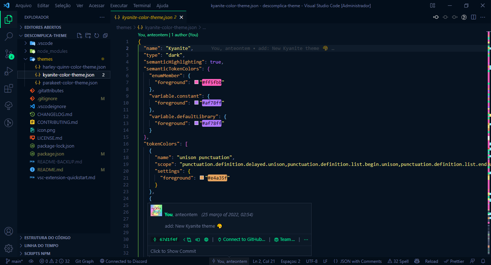

<h1 align="center">
    
    <br>
    Descomplica Theme for <a href="https://code.visualstudio.com">Visual Studio Code</a>
</h1>
<h4 align="center">Dark themes for Visual Studio Code</h4>
<p align="center">
    
    
    
    
    <a href="https://github.com/Descomplica-ADS/vscode-theme/blob/main/LICENSE.md">
        
    </a>
</p>
<p align="center">
    <a href="#running-the-project-%EF%B8%8F">Running</a>&nbsp;&nbsp;&nbsp;•&nbsp;&nbsp;&nbsp;
    <a href="#contribution-">Contribution</a>&nbsp;&nbsp;&nbsp;•&nbsp;&nbsp;&nbsp;
    <a href="#license-%EF%B8%8F">License</a>
</p>

<p align="center"></p>
<!--<a href="./.github/README-IMGS.md">View more</a>-->

## Running the project 🚴🏻‍♂️
### "I'll just take a look...":
  - <a href="https://marketplace.visualstudio.com/items?itemName=NyctibiusVII.descomplica-theme">Visual Studio Code marketplace</a>
  - <a href="https://themes.vscode.one/theme/NyctibiusVII/ihq0tPjA">Theme Studio for VS Code (Kyanite theme)</a>
  - <a href="https://github.com/Descomplica-ADS/vscode-theme">Project on Github</a>

### On your machine:
<details>
    <summary>Dependencies</summary>

```json
    "dependencies": {},
    "devDependencies": {
        "vsce": "^2.7.0",
        "yo": "^4.3.0"
    }
```
> Ex: `$ npm install _____` or `$ yarn add _____` to install the dependencies.

> Use the tag `-D` to install development dependencies.<br>
> Use the tag `@types` to install Typescript support.<br>
> Use the tag `@latest` to install the latest version.
</details>

```bash
# Clone the repository
$ git clone https://github.com/Descomplica-ADS/vscode-theme.git

# Access the project folder in the terminal
$ cd descomplica-theme

# Install the dependencies
$ npm install   /   yarn add
```

## Contribution 💭
Want to [contribute](https://github.com/Descomplica-ADS/vscode-theme/blob/main/CONTRIBUTING.md) to this project? Then send your PR and be part of the team.

## Team 🚀
This theme is maintained by the following person(s).
| [](https://github.com/NyctibiusVII) | [](https://github.com/Suburbanno) |
| :---: | :---: |
| <sub>[Matheus Vidigal](https://github.com/NyctibiusVII)</sub> | <sub>[Vinicius Rodrigues](https://github.com/Suburbanno)</sub> |

## License ⚖️
This project is under the MIT license. See the [LICENSE](https://github.com/Descomplica-ADS/vscode-theme/blob/main/LICENSE.md) file for more details.